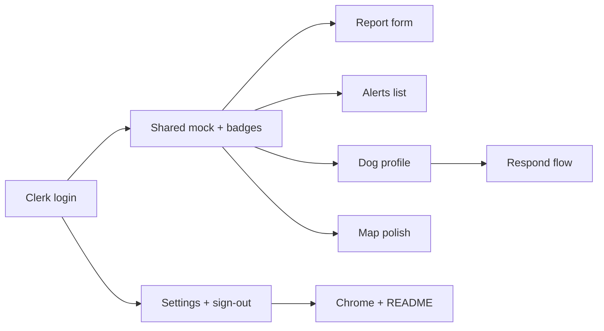

# Next improvements — feat/PHI-1-design

Follow-on work after the mobile-first shell landed on `feat/PHI-1-design` (`abe5d4f`). This plan turns the remaining prototype screens and stubs into usable UI, and adds a **basic username/password login** wired for **Clerk** authentication. Case data stays mock-first unless noted.

## Current baseline

| Area | Status |
|------|--------|
| Bottom nav (Home / Map / Report / Alerts / Settings) | Done |
| Home (name under salutation, no volunteer tasks) | Done |
| Map (full-bleed, filter sheet, floating pin cards + close) | Done |
| Settings (email, password, accounts, contributions, donate) | UI shell only |
| Report | Stub (“coming soon”) |
| Alerts | Stub (“coming soon”) |
| Dog profile / emergency respond flows | Not started |
| Auth / login | Not started |
| Real map SDK, payments, Prisma case persistence | Out of scope for this pass |

Theme source of truth remains [`app/globals.css`](../app/globals.css) + [`DESIGN.md`](../DESIGN.md) (happy-philo / Quicksand). Prefer shadcn components already under `components/ui/`.

## Goals for this pass

1. Ship a basic **username + password** sign-in (and minimal sign-up) UI, integrated with **Clerk**.
2. Gate the main app shell behind auth; signed-out users land on login.
3. Replace Report and Alerts stubs with prototype-parity UI.
4. Add Dog profile and a lightweight Respond/Emergency surface reachable from Home and Map.
5. Polish Map filters and empty states; keep map SDK-free (placeholder grid is fine).
6. Make Settings sections feel complete; connect email / password reset / sign-out to Clerk where straightforward.
7. Shared mock data + status badge helpers so screens stay consistent.

## Non-goals

- Neon/Prisma case persistence
- Real geolocation / Mapbox / Google Maps (use Leaflet.js with hardcoded Colombo, Sri Lanka locations instead)
- Stripe donate / real payments
- Full social OAuth UX polish (Google/Apple can remain Clerk-ready stubs or deferred; primary path is username/password)
- Volunteer task board (intentionally removed from Home)
- MFA, organizations, or Clerk Billing

---

## Workstreams

### 1. Auth with Clerk (username / password)

**Why:** Settings already assumes an account; Home shows a display name. Login should be real enough to protect the app shell and feed identity into Home/Settings.

**Provider:** [Clerk](https://clerk.com) (`@clerk/nextjs`) for Next.js App Router.

**Do:**

- Install and configure Clerk (`ClerkProvider` in root layout, env vars `NEXT_PUBLIC_CLERK_PUBLISHABLE_KEY`, `CLERK_SECRET_KEY`, and sign-in/sign-up URLs).
- Enable **username + password** in the Clerk dashboard (disable or de-emphasize email-only if it conflicts; username is the primary identifier in our UI).
- Add unauthenticated routes outside the bottom-nav shell:
  - `/sign-in` — username + password form
  - `/sign-up` — username + password (+ confirm password) form
- Prefer a **custom Philos-styled form** (shadcn `Input` / `Label` / `Button`, happy-philo tokens) using Clerk’s low-level hooks (`useSignIn`, `useSignUp`) over default Clerk hosted components, so login matches the mobile app look. Fall back to `<SignIn />` / `<SignUp />` only if custom wiring blocks progress.
- Protect `app/(app)/*` via Clerk middleware (`clerkMiddleware` + `auth.protect` or route matchers) so unauthenticated users redirect to `/sign-in`.
- After sign-in, redirect to `/` (Home). Sign-out from Settings clears the session and returns to `/sign-in`.
- Home salutation name: use Clerk `user.username` or `user.firstName` instead of the hard-coded `Alex` mock when signed in.
- Settings **Email** / **Password reset**: wire to Clerk user profile APIs or “forgot password” flow where low-effort; otherwise keep UI and call Clerk’s password reset for the signed-in user’s identifier.
- Document Clerk setup steps in README (dashboard flags, env template).

**Done when:** A user can sign up with username/password, sign in, see their name on Home, sign out from Settings, and cannot open `/map` (etc.) while signed out.

### 2. Shared case model and UI primitives

**Why:** Home, Map, Report, Alerts, and Profile all show the same statuses and dogs with slightly different copy today.

**Do:**

- Expand [`lib/mock-data.ts`](../lib/mock-data.ts) into a single case catalog (id, name, status, location, distance, notes, timeline steps, photos placeholder).
- Add `components/cases/status-badge.tsx` mapping status → Badge variant / colors used on Home + Map.
- Add `components/cases/case-list-row.tsx` for Home nearby list and Alerts deep-links consistency.

**Done when:** Changing a dog once in mock data updates Home + Map without copy-paste.

### 3. Report a dog (`/report`)

**Port from prototype** `report-dog.html` (photos, location, condition chips, notes, submit).

**Do:**

- Client form with:
  - Photo upload zone (click → show placeholder thumbnails; no real upload).
  - Location text field (+ optional “Use my location” button that fills mock coords/text).
  - Condition / severity chip group (single or multi — match prototype).
  - Notes textarea.
  - Submit enabled only when required fields are set.
- Success dialog (`Dialog` or `AlertDialog`) then navigate to `/map` or new case profile.
- Keep bottom nav; raised Report tab stays active on this route.
- Requires authenticated session (covered by middleware).

**shadcn:** `textarea` (add if missing), `dialog` / `alert-dialog`, existing `button`, `label`, `input`, `checkbox`/`badge` for chips.

**Done when:** User can complete a mock report end-to-end without leaving the app chrome.

### 4. Alerts (`/alerts`)

**Port from prototype** `notifications.html`.

**Do:**

- Day groupings (“Today”, “Yesterday”).
- Unread indicator + “Mark all as read” top action (local state).
- Filter chips: All / Urgent / Updates / Foster (or match prototype filters).
- Rows link to dog profile or map pin where relevant.

**Done when:** Filters and read/unread behave client-side with mock items.

### 5. Dog profile (`/cases/[id]`)

**Port from prototype** `dog-profile.html`.

**Do:**

- Dynamic route using mock catalog id (`bruno`, `milo`, …).
- Sections: hero/photo placeholder, status + tracker steps, temperament/health notes, primary CTAs (Respond / Foster interest — UI only).
- Back affordance to previous tab (or hard links from Home/Map).
- Wire Home list rows and Map “View profile” to `/cases/[id]` instead of `#`.

**Done when:** Every mock pin/list item opens a dedicated profile.

### 6. Respond / emergency (`/cases/[id]/respond` or `/emergency`)

**Port from prototype** `emergency.html` at a lighter fidelity.

**Do:**

- Short confirmation flow: what help is needed, ETA chip, confirm button → success toast/dialog.
- Entry points: Map card “Respond”, urgent Home banner, profile CTA.
- Stay mock-only; no volunteer assignment backend.

**Done when:** Respond path is reachable and closes with clear confirmation UI.

### 7. Map polish

**Do:**

- Replace placeholder grid with **Leaflet.js**; center on **Colombo, Sri Lanka** with hardcoded dog/pin locations.
- Persist selected filters in `sessionStorage` for the tab session.
- Empty state when filters hide all pins.
- Ensure floating card clears when filters hide the selected pin.
- Tapping the search control expands an inline search box.
- Optional: list mode toggle deferred unless needed; map-only remains default.
- Legend stays compact; avoid overlapping the filter FAB and detail card.

**Done when:** Map renders with Leaflet.js over hardcoded Colombo locations; filters and search expansion behave correctly.

### 8. Settings hardening (Clerk-aware)

**Do:**

- Email: show Clerk account email; basic format validation + save via Clerk user update when available.
- Password reset: trigger Clerk reset / “forgot password” for the signed-in identifier; show confirmation copy.
- Connected accounts: keep Google / Apple rows as placeholders unless Clerk social is enabled in the same pass; do not block username/password shipping.
- **Sign out** row/button that calls Clerk `signOut()`.
- Donate: secondary amounts chips ($5 / $15 / $50) + primary CTA that shows a thank-you dialog (no payment).
- Contributions: empty state if list cleared; keep sample rows by default.

**Done when:** Every settings section has a visible interaction result; sign-out returns to login.

### 9. App chrome polish

**Do:**

- Safe-area padding audit on iOS (nav + map overlays).
- Map route: hide sticky page padding conflict; confirm full-bleed under top gradient.
- Auth screens: no bottom nav; mobile-first centered card matching Philos branding.
- Replace starter leftovers in [`README.md`](../README.md) (Geist / `app/page.tsx` references) + Clerk env setup.
- Accessibility: focus rings on map pins, `aria-expanded` on filter sheet, dialog labels, labeled login fields + error messages.

---

## Suggested implementation order

1. Clerk setup + `/sign-in` / `/sign-up` + middleware protecting `(app)`  
2. Home display name + Settings sign-out from Clerk user  
3. Shared mock + status badge / list row  
4. Dog profile + link wiring from Home/Map  
5. Report form  
6. Alerts  
7. Respond flow  
8. Map polish  
9. Settings hardening (email / password reset / donate UX)  
10. README + a11y pass  

## File touch list (expected)

| Path | Change |
|------|--------|
| `middleware.ts` | Clerk middleware + public route matchers |
| `app/layout.tsx` | Wrap with `ClerkProvider` |
| `app/sign-in/[[...sign-in]]/page.tsx` (or fixed `/sign-in`) | Username/password sign-in UI |
| `app/sign-up/[[...sign-up]]/page.tsx` (or fixed `/sign-up`) | Username/password sign-up UI |
| `components/auth/*` | Optional shared auth form chrome |
| `.env.example` | Clerk publishable + secret key placeholders |
| `lib/mock-data.ts` | Expand case + alert + contribution mocks |
| `components/cases/*` | Shared badge / list row |
| `app/(app)/report/page.tsx` | Full form UI |
| `app/(app)/alerts/page.tsx` | Notifications UI |
| `app/(app)/cases/[id]/page.tsx` | New profile |
| `app/(app)/cases/[id]/respond/page.tsx` | New respond flow (or sibling route) |
| `components/map/rescue-map.tsx` | Profile links + filter edge cases |
| `app/(app)/page.tsx` | Profile links + Clerk display name |
| `app/(app)/settings/page.tsx` | Clerk-aware fields + sign-out |
| `components/ui/*` | Add dialog / textarea via shadcn as needed |
| `README.md` | Philos app + Clerk setup |
| `package.json` | `@clerk/nextjs`, `leaflet`, `@types/leaflet` dependencies |

## Acceptance checklist

- [ ] User can sign up and sign in with **username + password** via Clerk  
- [ ] Unauthenticated visits to app routes redirect to `/sign-in`  
- [ ] Home shows the signed-in user’s name (not hard-coded Alex)  
- [ ] Settings can sign the user out  
- [ ] Report and Alerts are no longer stubs  
- [ ] Home nearby cases and Map “View profile” open `/cases/[id]`  
- [ ] Respond path works from urgent banner and Map card  
- [ ] Map uses Leaflet.js with hardcoded Colombo, Sri Lanka locations  
- [ ] Map filters handle empty + deselect correctly  
- [ ] Tapping search expands an inline search box  
- [ ] Settings actions show confirmations; password reset uses Clerk when wired  
- [ ] Visual language still matches happy-philo tokens (no new purple/glow theme drift)  
- [ ] Mobile viewport: bottom nav never covers primary CTAs; auth screens have no bottom nav  

## Open decisions (resolve when implementing)

1. **Respond route shape:** nested under `/cases/[id]/respond` vs top-level `/emergency`. Prefer nested for clearer ownership.  
2. **After mock report submit:** land on new profile vs Map. Prefer profile for continuity.  
3. **Whether to reintroduce Volunteer** as a Settings subsection later — not in this pass.  
4. **Clerk UI approach:** custom username/password forms (preferred for brand fit) vs Clerk prebuilt `<SignIn />` / `<SignUp />` components as a faster MVP. Prefer custom; allow prebuilt fallback.  
5. **Identifier:** username-only vs username *or* email. Prefer username as the visible field; Clerk may still store email optionally for reset delivery.  
6. **Social providers:** defer Google/Apple until after username/password works, even if Settings shows placeholder rows.
